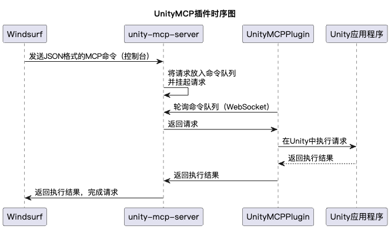

# 使用说明

## 安装软件
1. 下载、安装Windsurf并注册Codeium账号。
2. 安装Unity 2022.3
   - 下载安装 Unity Hub，注意不是团结引擎。
   - 到 https://unity.com/releases/editor/archive 下载Unity 2022.3.x最新版本。如果自动跳转到了unity.cn的域名，就在浏览器输入 unityhub://2022.3.59f1/630718f645a5 在Unity Hub中打开。如果是苹果M芯片电脑，就选择Silicon版本。
   - 安装的版本号要注意是f1结尾，而不是f1c1结尾。（虽然只是demo无所谓，要养成好习惯）
3. 在Unity Hub中创建项目
   - 模版选3D (Built-in Render Pipeline)
   - Location选的是项目的父文件夹，Unity会在里面新建项目自己的文件夹。
   - 底下两个Connect to Unity Cloud和Use Unity Version Control都不选，都是垃圾，还会导致很多问题。
4. 在Unity项目中配置Windsurf
   - https://github.com/Asuta/com.unity.ide.windsurf 配置完External Tools之后点一下Regenerate project files （如果要切换回Rider，也在这里操作）
   - 在项目中新建一个C#脚本，双击，会自动调用Windsurf打开。
## 配置MCP
1. 把本项目克隆下来
2. UnityMCPPlugin文件夹扔进项目的Assets里
3. 配置项目依赖项，修改Packages/manifest.json 加上NewtonsoftJson和TextMeshPro
```json
{
  "dependencies": {
    ...

    "com.unity.ide.windsurf": "https://github.com/Asuta/com.unity.ide.windsurf.git",
    "com.unity.nuget.newtonsoft-json": "3.2.1",
    "com.unity.textmeshpro": "3.0.7",

    ...
  }
}
```
4. 安装好NodeJS（版本18以上），进入unity-mcp-server文件夹，编译：
```bash
npm i
npm run build
```
5. 在Windsurf里点聊天输入框上面的锤子图标，选右边的Configure，修改配置
```json
{
    "mcpServers": {
      "UnityMCP": {
        "command": "node",
        "args": ["/注意这里要写绝对路径/UnityMCP/unity-mcp-server/build/index.js"]
      }
    }
}
```
6. 点Refresh，上面一行出现UnityMCP 3 tools就是成功了

## 常见问题和小帖士
1. 配置完之后，我的Windsurf打不开Cascade窗口了！
   - 怪你自己mcp配置错了。Mac下打开 ~/.codeium/windsurf/mcp_config.json 重新编辑，Windows自己找吧。
2. 有什么最佳实践？
   - 看[CONTRIBUTING.md](doc/CONTRIBUTING.md)，可以让Cascade添加到memory里。
3.  每次Windsurf执行完多关注Log里的报错，也让Windsurf自己关注
4.  让Windsurf自己检查场景有没有设置错误
5.  Windsurf让你操作Unity时，可以告诉他使用UnityMCP来操作
6.  改到相对正确的版本时，一定要先提交！
7.  Windsurf执行时，尽量把焦点切换到Unity窗口，因为修改完的代码需要实时重新编译才能起作用，而Windsurf不会等太长时间。
## 原理


以下为原版README内容：
=


# UnityMCP

UnityMCP is a powerful Unity Editor plugin that implements the Model Context Protocol (MCP), enabling seamless integration between Unity and AI assistants. It provides real-time editor state monitoring, remote command execution, and comprehensive logging capabilities.


## Architecture

The project consists of two main components:

### 1. Unity Plugin (UnityMCPPlugin)

A Unity Editor plugin that provides:
- Debug window for connection status and monitoring
- WebSocket client for real-time communication
- C# code execution engine
- Comprehensive logging system
- Editor state tracking and serialization

### 2. MCP Server (unity-mcp-server)

A TypeScript-based MCP server that exposes Unity Editor functionality through standardized tools:

#### Available Tools

1. `get_editor_state`
   - Retrieves current Unity Editor state
   - Includes active GameObjects, selection state, play mode status
   - Provides scene hierarchy and project structure
   - Supports different output formats (Raw, scripts only, no scripts)

2. `execute_editor_command`
   - Executes C# code directly in the Unity Editor
   - Full access to UnityEngine and UnityEditor APIs
   - Real-time execution with comprehensive error handling
   - Command timeout protection

3. `get_logs`
   - Retrieves and filters Unity Editor logs
   - Supports filtering by type, content, and timestamp
   - Customizable output fields
   - Buffer management for optimal performance

## Installation

### Prerequisites
- Unity 2022.3 or later
- Node.js 18 or later
- npm 9 or later

### Unity Plugin Setup

1. Copy the `UnityMCPPlugin` folder to your Unity project's Assets directory
2. Open Unity Editor
3. Access the plugin through Window > UnityMCP > Debug Window

### MCP Server Setup

```bash
cd unity-mcp-server
npm install
npm run build
```

## Usage

### Starting the Server

```bash
cd unity-mcp-server
node build/index.js
```

### Connecting from Unity

1. Open your Unity project
2. Open the UnityMCP Debug Window (Window > UnityMCP > Debug Window)
3. The plugin will automatically attempt to connect to the MCP server
4. Monitor connection status and logs in the debug window

### Example: Executing Commands

```csharp
// Center the selected object
Selection.activeGameObject.transform.position = Vector3.zero;

// Toggle play mode
EditorApplication.isPlaying = !EditorApplication.isPlaying;

// Create a new cube
GameObject.CreatePrimitive(PrimitiveType.Cube);
```

## Development

### Building the Server

```bash
cd unity-mcp-server
npm run build
```

### Watching for Changes

```bash
npm run watch
```

### Inspecting MCP Communication

```bash
npm run inspector
```

## Technical Details

### Communication Protocol

- WebSocket-based communication on port 8080
- Bidirectional real-time updates
- JSON message format for all communications
- Automatic reconnection handling

### Security Features

- Command execution timeout protection
- Error handling and validation
- Log buffer management
- Connection state monitoring

### Error Handling

The system provides comprehensive error handling for:
- Connection issues
- Command execution failures
- Compilation errors
- Runtime exceptions
- Timeout scenarios

## Contributing

1. Fork the repository
2. Create your feature branch (`git checkout -b feature/amazing-feature`)
3. Commit your changes (`git commit -m 'Add amazing feature'`)
4. Push to the branch (`git push origin feature/amazing-feature`)
5. Open a Pull Request

## License

This project is private and not licensed for public use.
